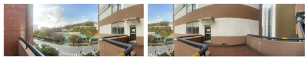
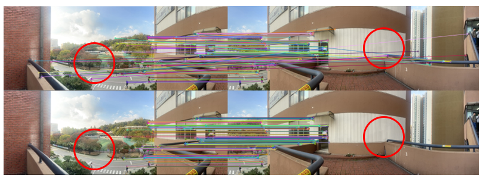
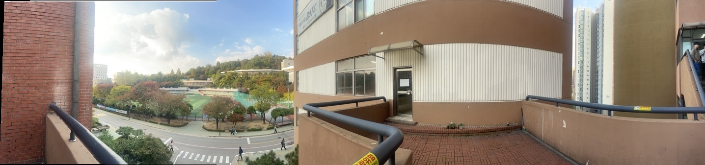

# Visual Odometry, Midterm Assignment

- **학번**: 120230196
- **학생 이름**: 조이준

## Problem Statement
중간 대체 과제는 두 개의 입력 이미지를 사용하여 파노라마 이미지를 생성하는 것입니다. 과제 수행 절차는 다음과 같습니다:
1. 서강대학교 내부에서 서로 다른 시점의 두 이미지를 촬영합니다.
2. OpenCV 라이브러리를 사용하여 두 이미지의 ORB(특징점)와 특징점 디스크립터를 계산합니다.
3. 계산한 특징점들을 Hamming 거리를 사용하여 Brute Force 매칭을 수행하여 매칭 리스트를 생성합니다.
4. RANSAC 알고리즘을 직접 작성하여 Homography 행렬을 계산합니다.
5. 직접 작성한 코드로 파노라마 이미지 틀을 생성합니다.
6. 직접 작성한 코드로 두 입력 이미지를 Homography 행렬을 사용하여 파노라마 틀에 합칩니다.
7. 동일한 과정을 다른 두 이미지 세트에도 적용합니다.

## Algorithm
알고리즘은 다음과 같은 함수 기반 모듈화로 구현되었습니다:

1. **Global**: 입력 및 출력 경로, RANSAC 반복 횟수, RANSAC 임계값을 인자로 받습니다.
2. **main**: 두 이미지 경로, 출력 이미지 경로, RANSAC 반복 횟수 및 임계값을 인자로 받아 ORB 특징점 추출 및 매칭을 수행하고 파노라마 이미지를 생성합니다.
3. **DIY_HOMOGRAPHY**: 두 이미지의 특징점, 매칭 결과, RANSAC 반복 횟수 및 임계값을 인자로 받아 Homography 행렬을 계산합니다.
4. **DIY_RANSAC**: 두 이미지의 매칭된 특징점, 최대 반복 횟수 및 임계값을 인자로 받아 RANSAC를 수행하고 최적의 Homography 행렬을 반환합니다.
5. **DIY_PANORAMA**: 두 이미지 및 Homography 행렬을 입력으로 받아 파노라마 이미지를 생성합니다.
6. **DIY_WARPING**: 이미지, 파노라마 틀 크기 및 Homography 행렬을 입력으로 받아 이미지를 틀에 합칩니다.

## Experiment
실험 결과
## 첫 번째 실험에서 사용한 두 이미지

## ORB 키포인트 매칭 비교 결과

## 최종 파노라마 이미지

